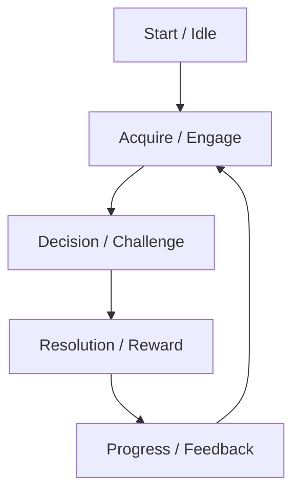

## Execution Flow (main)

1. Parse High Concept and Purpose → ERROR if missing.
2. Define Player Fantasy & Pillars.
3. Outline Core Loop and Session Flow.
4. Specify Rules & Mechanics with clarity.
5. Document Entities, Attributes, Progression, Win/Loss.
6. Capture Rewards, Feedback, Accessibility, Edge Cases.
7. Bound scope (vertical slice) + out-of-scope.
8. Mark open questions → FAIL review if unresolved.
9. Run Checklist → SUCCESS if all mandatory sections filled and no `[NEEDS CLARIFICATION]`.

# Game Design Document (GDD): [GAME TITLE]

**Design ID**: [GDD-###]  
**Author**: [Name / Role]  
**Contributors**: [Names / Roles]  
**Version**: [vX.Y] • **Date**: [YYYY-MM-DD] • **Status**: Draft

## Section Rules (Mandatory vs Optional)

| Section                             | Mandatory? | Notes                                   |
| ----------------------------------- | ---------- | --------------------------------------- |
| High Concept                        | **Yes**    | Elevator pitch                          |
| Purpose & Target Audience           | **Yes**    | Audience, motivations, play session     |
| Player Fantasy & Pillars            | **Yes**    | 3–5 concise design pillars              |
| Core Loop                           | **Yes**    | Repeating cycle (text + diagram)        |
| Session Flow                        | **Yes**    | From launch to closure                  |
| Rules (setup, actions, constraints) | **Yes**    | Core ruleset                            |
| Mechanics                           | **Yes**    | Each mechanic fully defined             |
| Entities & Attributes               | **Yes**    | Data table with attributes/interactions |
| Progression & Difficulty            | **Yes**    | Unlocking, ramping, adaptivity          |
| Win / Loss / Failure                | **Yes**    | Clear victory/failure conditions        |
| Reward Systems                      | Optional   | Only if rewards exist                   |
| Feedback & Juiciness                | **Yes**    | Player-facing communication of state    |
| Accessibility & Fairness            | **Yes**    | Design ethics + safeguards              |
| Edge Cases & Exploits               | **Yes**    | Potential abuses & mitigations          |
| Content Scope (Initial Slice)       | **Yes**    | Narrow, testable MVP                    |
| Open Questions                      | **Yes**    | Unresolved issues must be tracked       |
| Out of Scope                        | **Yes**    | Explicit exclusions                     |

## 1. High Concept [MANDATORY]

One or two sentences capturing the core identity / elevator pitch.

## 2. Purpose & Target Audience [MANDATORY]

- Primary audience(s)
- Player motivation (emotional loop)
- Typical session length

## 3. Player Fantasy & Pillars [MANDATORY]

- Pillar 1: Short phrase + 1 sentence
- Pillar 2: …
- Pillar 3: … (3–5 total)

## 4. Core Loop [MANDATORY]

Describe the repeating cycle in 3–6 steps.

## 5. Session Flow [MANDATORY]

Short walkthrough from launch → first decision → escalation → closure.

## 6. Rules [MANDATORY]

### 6.1 Setup

### 6.2 Turn / Phase Structure (if applicable)

### 6.3 Player Actions

- Action Name: Preconditions → Outcome → Risk/Reward

### 6.4 Constraints & Limits

## 7. Mechanics [MANDATORY]

For each core mechanic:

- **Name** – Description; Purpose; Player Impact; Failure / Edge considerations

## 8. Entities & Attributes [MANDATORY]

| Entity | Purpose | Key Attributes | Interactions |
| ------ | ------- | -------------- | ------------ |
|        |         |                |              |

## 9. Progression & Difficulty [MANDATORY]

- Unlock / gating model
- Difficulty ramp principles
- Adaptive elements (if any)

## 10. Win / Loss / Failure Conditions [MANDATORY]

- Win: …
- Loss: …
- Soft fail / recovery: …

## 11. Reward Systems [OPTIONAL]

If present:

- Type → Player Value → Frequency → Anti-grind safeguards

## 12. Feedback & Juiciness [MANDATORY]

How the game communicates state changes (verbs only, no tech).

## 13. Accessibility & Fairness [MANDATORY]

- Cognitive load mitigation
- Fairness principles
- Avoided negative patterns

## 14. Edge Cases & Exploits [MANDATORY]

Potential abuses & mitigation principles.

## 15. Content Scope (Initial Slice) [MANDATORY]

Define first playable vertical slice: narrow, representative, minimal.

## 16. Open Questions [MANDATORY]

? Unresolved assumption…  
? Ambiguous rule…

## 17. Out of Scope [MANDATORY]

Explicit exclusions (e.g., multiplayer not included).

---

## Acceptance Criteria

- ✅ All **mandatory sections** filled in.
- ❌ Any mandatory section missing or containing only `[NEEDS CLARIFICATION]` → FAIL review.
- ⚠ Optional sections included only when relevant.

---

## Review Checklist

- [ ] High concept captured
- [ ] Audience and pillars clear
- [ ] Core loop & session flow mapped
- [ ] Rules & mechanics unambiguous
- [ ] Entities & attributes table completed
- [ ] Progression, win/loss, feedback defined
- [ ] Accessibility & fairness addressed
- [ ] Edge cases & scope documented
- [ ] No `[NEEDS CLARIFICATION]` remain
